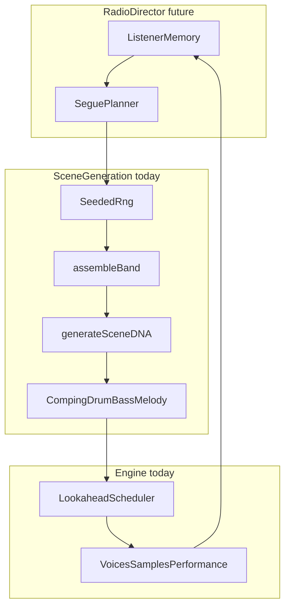

# Drift DNA Roadmap

A phased plan for evolving Nightdrift into a richer **algorithmic late-night radio station** — procedural grammars, constraint systems, and state machines built on the existing Web Audio engine.

**Non-goals:** neural nets, training pipelines, LLMs, cloud inference, or any “AI” layer. Creativity stays in the same realm as today’s rule-based generators in `lib/audio/drift-algorithm.ts`.

---

## Vision

Nightdrift is an infinite playlist where each “track” is a **scene**: a bundle of musical decisions (key, band, progression, DNA, grammars) generated once, then performed by a lookahead scheduler. The listener steers mood; the station drifts.

The long-term goal is a **Radio Director** — a station-level layer that decides *what kind of drift happens next* using composable algorithms and memory, not isolated random draws.

**SceneDNA** is the **genotype**: roughly thirty continuous and categorical parameters that describe how a scene *feels*. The **engine** is the **phenotype**: it reads DNA every scheduling step and turns it into notes, hits, and effects.

Creativity expands through:

- Better **genotype generators** (how DNA is composed)
- **Genotype evolution** within and across scenes (mutation, crossover, memory)
- Better **phenotype interpreters** (comping grids, bass grammars, melody contour generators)
- A **station-level state machine** (segues, continuity, broadcast pacing)

---

## How it works today (DNA → engine)

1. **`makeScene(family, prev?, rng?)`** in `lib/audio/scenes.ts` assembles a scene under a seeded RNG (`lib/audio/rng.ts`, `lib/audio/random.ts`).
2. **`generateSceneDNA()`** in `lib/audio/drift-algorithm.ts` composes timing, patterns, effects, environment, structure, and melody DNA from mood family + band + kit.
3. **Grammars** derive concrete grids: `mutateDrumKit()`, `generateCompingPattern()`, `applyMelodyMutations()`.
4. **`createEngine()`** in `lib/audio/engine.ts` schedules playback; DNA fields drive humanize width, dropouts, comping, fills, ambience, and energy arcs via `sceneEnergy()`.

Share a reproducible drift: `http://localhost:3000/?seed=424242` (numeric or string; strings are hashed to a 32-bit seed).

### Current baseline

| Layer | File(s) | Status |
|-------|---------|--------|
| SceneDNA | `lib/audio/drift-algorithm.ts` | Rule-based `generateSceneDNA()` |
| Seeded scene generation | `rng.ts`, `random.ts`, `scenes.ts` | Scenes reproducible via `?seed=` |
| Drum mutation | `mutateDrumKit()` | Per-scene kick/ghost variation |
| Comping algorithms | `lib/audio/comping-patterns.ts` | Per-style hit grids |
| Melody mutations | `lib/audio/melodies.ts` | `applyMelodyMutations()`, DNA-aware `varyPhrase()` |
| Human performance | `lib/audio/performance/` | Per-instrument shaping |
| Samples | `lib/audio/sample-library.ts` | Lazy warm; partial voice coverage |
| Playback randomness | `lib/audio/engine.ts` | Seeded playback stream (`scene.seed ^ PLAYBACK_SALT`) |
| Intra-scene evolution | `lib/audio/drift-evolution.ts` | Round modifiers, fills, melody arc, energy automation |
| Bass grammars | `lib/audio/bass-patterns.ts` | Groove, anchor, walking pattern generators |
| Melody grammars | `lib/audio/melody-grammar.ts` | Contour generator blended with phrase library |
| Progression reharm | `lib/audio/progression-grammar.ts` | DNA-gated subs, modal borrow, passing chords |
| Layered ambience | `lib/audio/ambience.ts` | Primary + secondary bed stack |
| Radio Director | `lib/audio/radio-director.ts` | Station memory, segue planner, event scheduling |
| Dynamics grammar | `lib/audio/dynamics-grammar.ts` | Duck profiles, tape saturation bursts |

---

## Design principles

1. **DNA is data, not magic** — Every parameter has a musical meaning and a bounded range. When adding fields, document min/max and which engine function reads them.
2. **Seeds are the undo button** — New randomness in generative paths must flow through `Rng` and be forkable. Avoid bare `Math.random()` in scene composition and (eventually) playback.
3. **Grammars over tables** — Prefer small generators (Markov chains, constraint pickers, L-system-style rules) over huge hand-authored arrays.
4. **Compose, don't replace** — Mined melodies, band definitions, and kit templates stay. Algorithms *vary* and *combine* them.
5. **One scene = one genotype** — Intra-scene change is mutation of that genotype, not spawning a second scene.

---

## Phase 1 — Complete the DNA loop

**Status: complete.**

**Goal:** DNA fully drives both *composition* and *performance*; scenes are replayable end-to-end.

| Task | Description | Touch points |
|------|-------------|--------------|
| Playback seeding | Fork `createRng(scene.seed ^ playbackSalt)` in `beginScene()`; route scheduler randomness through the playback stream | `engine.ts` |
| Bass grammar | Extract `makeBassRiff()` into `lib/audio/bass-patterns.ts` — walking (scale/chord-tone Markov), groove (kick-locked syncopation), anchor (sparse root/fifth grid) from `drumGrammar` + `bassStyle` + `PatternDNA` | `scenes.ts`, new `bass-patterns.ts` |
| Shareable drifts | Show `SceneSummary.seed` in UI with copy-link (`?seed=&mood=`) | `components/nightdrift/nightdrift.tsx` |
| Seed snapshots | Fixed seed → stable JSON snapshot of scene fields (guards accidental algorithm drift) | new test file |

**Exit criteria:** Same URL seed + mood reproduces the same scene *and* the same performance take.

---

## Phase 2 — Intra-scene evolution

**Status: complete.**

**Goal:** A scene *changes* over its 3–5 rounds instead of repeating a frozen DNA snapshot.

| Task | Description | Touch points |
|------|-------------|--------------|
| Round modifiers | At round boundaries, fork RNG and apply bounded mutations (e.g. `dropoutChance` rises toward outro, `fillIntensity` peaks mid-scene) | new `lib/audio/drift-evolution.ts`, `engine.ts` round hooks |
| Energy-linked automation | Map `sceneEnergy()` continuously to tape cutoff, reverb send, ambience movement — not only per-chord dice rolls | `engine.ts`, `applyAtmosphere()` |
| Drum fill grammar | Round-aware fill templates (pickup → variation → sparse outro) from `fillIntensity` + round index | `engine.ts`, `drift-evolution.ts` |
| Melody round arc | Mutate `roundCycle` at round 2+ capped by `MelodyDNA.mutationStrength` | `engine.ts`, `melodies.ts` |

**Exit criteria:** Listening to rounds 1 vs 3 of the same scene feels like the band settling in and thinning out, not a loop.

---

## Phase 3 — Generative grammars

**Status: complete.**

**Goal:** Less reliance on static libraries; more procedural content from small rule sets.

| Task | Description | Touch points |
|------|-------------|--------------|
| Melody contour generator | Generate `PhraseCell[]` from contour classes (`arch`, `question`, `answer`, `tag`, `sigh`) + scale length + mood; blend with mined phrases | `lib/audio/melody-grammar.ts`, `melodies.ts` |
| Counter-voice algorithm | Echo primary phrase on harmony bus (+8ve / +3rd, delayed), gated by `harmonyMul` and energy | `engine.ts` |
| Progression variants | DNA-gated passing chords, tritone subs, modal interchange on family templates | `progression-grammar.ts`, `scenes.ts` |
| Layered ambience | Ambience stack (primary + optional secondary bed); weights follow `energyShape` | `ambience.ts`, `drift-algorithm.ts`, `drift-evolution.ts` |

**Exit criteria:** Scenes regularly contain phrases and harmonic colors that were not literally stored in a library row.

---

## Phase 4 — Radio Director

**Status: complete.**

**Goal:** Scenes feel like a curated broadcast, not independent random draws.

| Task | Description | Touch points |
|------|-------------|--------------|
| `RadioState` | Rolling memory: last N families, band ids, keys, energy shapes, BPM range | `lib/audio/radio-director.ts` |
| Segue planner | Weighted transition table + DNA continuity (inherit one trait from previous scene via seeded crossover) | `radio-director.ts`, `makeScene()` |
| Beatless bridge grammar | Formal macro pattern for intro/outro/segue (beatless bars → tempo morph → drum fade-in) | `engine.ts` |
| Event scheduling | Poisson-style ambient events from `EnvironmentDNA.eventRate`, bed type, cooldown memory | `engine.ts` `maybePlayEvent()` |

**Exit criteria:** Mood changes and segues feel intentional — complementary keys, shared tape character, or deliberate contrast.

---

## Phase 5 — Expressive depth

**Status: complete.**

**Goal:** Wider timbral palette and richer micro-timing without new architectural layers.

| Task | Description | Touch points |
|------|-------------|--------------|
| Sample expansion | Map remaining band voices; pair with performance handlers | `sample-library.ts`, `performance/` |
| Dynamics grammar | Snare/bus duck variants; tape saturation bursts tied to `filterDipChance` | `dynamics-grammar.ts`, `dynamics.ts`, `engine.ts` |
| Prefetch | During outro, fork next scene RNG and `warmForScene()` early | `engine.ts` |
| Visual DNA sync | Starfield / drift-presence react to energy shape and ambience bed | `starfield.tsx`, `drift-presence.tsx` |

**Exit criteria:** More bands sound “real”; segues are sample-glitch-free; UI subtly reflects the current drift.

---

## File map (where to add things)

| Concern | Existing | Planned |
|---------|----------|---------|
| DNA composition | `drift-algorithm.ts` | — |
| Round evolution | `drift-evolution.ts` | — |
| Scene assembly | `scenes.ts` | `radio-director.ts` |
| Bass | `makeBassRiff()` in `scenes.ts` | `bass-patterns.ts` |
| Comping | `comping-patterns.ts` | extend per-style generators |
| Melody | `melodies.ts` | `melody-grammar.ts` |
| Harmony | `scenes.ts` | `progression-grammar.ts` |
| Playback | `engine.ts` | playback RNG, round hooks, prefetch |
| Reproducibility | `rng.ts`, `random.ts` | snapshot tests |
| Docs | `architecture.md` | this file |

---

## Open questions

- **Counter-melody timbre:** Synth-only voices to avoid extra sample load, or reuse harmony voice samples?
- **DNA size:** At what parameter count does a small visual “DNA inspector” help debugging more than it helps music?
- **Persist `RadioState`:** Should station memory survive refresh via `localStorage`, or reset each session for a fresh broadcast?
- **Mood in URL:** Should `?mood=rainy` be official alongside `?seed=` for fully shareable sessions?

---

## Related docs

- [architecture.md](./architecture.md) — runtime graph, hook lifecycle, extension table
- [musicality-roadmap.md](./musicality-roadmap.md) — tune packages, harmonic binding, song form
