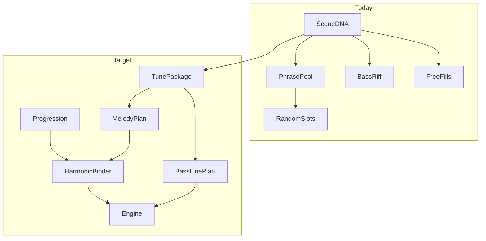

# Musicality Roadmap

A plan to make Nightdrift scenes feel like **actual songs** — not disparate notes stitched together at playback time.

The DNA roadmap built a solid **station** (grammars, evolution, segues). This document addresses the **song layer**: tune identity, harmonic binding, and cross-voice continuity.

---

## Why it feels disparate today

| Layer | What happens now | Why it breaks "song" feel |
|-------|------------------|---------------------------|
| **Phrase pick** | A, B, answer, tag come from different library rows (`variantIdx + offset`) and get grammar-blended | Hook and answer often aren't from the same source tune |
| **Mining** | Segments round-robin into A/B/answer/tag; `build-mined-library` keeps 2 templates *per id* from *different files* | Coherent tunes get shredded into interchangeable parts |
| **Harmony** | Same phrase contour on every chord; only first/long notes snap to chord tones | Melody doesn't "go with" the progression |
| **Fills** | Random stepwise wander from `fillIdx` on odd chords | Fights the structured melody instead of extending it |
| **Bass** | One 2-bar riff looped on every chord | No 4-chord line; doesn't follow the tune |
| **Presence** | ~72–95% chance per slot | Hooks skip; form has holes |
| **Structure** | Generic AABA / call-response, not tied to progression shape | ii–V–I and I–vi–IV–V get the same dramatic arc |

The right primitive already exists: mined `PhraseCell[]` with `rel`, `step`, `beats`. The gap is **binding** — tune identity, harmonic role, and cross-voice continuity.

---

## Target architecture: Song genotype on Scene DNA

Not just *how* a scene is played (DNA), but *what tune* is being played.



---

## Phase A — Tune packages (mining → one song, not four parts) ✅

**Status:** Complete — `TunePackage` mining, `mined-tunes.ts` curation, and `assembleMelodyPlan()` package selection are wired.

**Goal:** A scene picks **one complete tune**, not four unrelated phrases.

### Tasks

1. **Extend `mine-melodies.ts` → tune packages**

   Output a `TunePackage` per MIDI file:

   ```ts
   interface TunePackage {
     id: string;
     mood: MoodKey;
     phrases: Record<PhraseId, PhraseTemplate>; // one each, same source
     structureHint?: StructureId;
     contourClass?: "arch" | "question" | "answer" | "tag"; // per section
   }
   ```

   **Smarter section labeling** (replace round-robin `i % 4`):

   - Repeat detection → repeated contours = **A**
   - Contrasting middle section = **B**
   - Penultimate resolving phrase = **answer**
   - Short tail (<4 cells) = **tag**

   Score packages: monophonic clarity, rest density, stepwise ratio (lofi = more stepwise, fewer jumps).

2. **Revise `build-mined-library.ts`**

   - Curate **whole packages**, not `PER_PHRASE = 2` from mixed files
   - Keep 3–5 complete tunes per mood; drop partial/shredded sets
   - When source is mined, disable grammar blend (`contourBlend = 0`) — they already sound human

3. **`assembleMelodyPlan()` picks a package**

   - `pickTunePackage(family, prev)` → all four phrases from same package id
   - Structure chosen from package's `structureHint` or progression fit (Phase B)

### Touch points

- `scripts/mine-melodies.ts`
- `scripts/build-mined-library.ts`
- `lib/audio/mined-tunes.ts` (replaces per-phrase `mined-phrases.ts` fold-in)
- `lib/audio/tune-packages.ts`, `lib/audio/tune-package-picker.ts`
- `lib/audio/melodies.ts` — `assembleMelodyPlan()`, `applyMelodyMutations()`

### Exit criteria

Same seed always plays the same *tune*, audibly recognizable across rounds.

---

## Phase B — Harmonic binding (melody ↔ progression) ✅

**Status:** Complete — `fitPhraseToChord()`, progression-aware slot maps, and per-chord `chordPhrases` are wired through scene assembly and playback.

**Goal:** The line respects where it is in the chord sequence.

### Tasks

1. **`fitPhraseToChord(phrase, chord, progressionDegree, scale)`**

   - Anchor phrase relative to **chord root** (or scale degree of progression step), not one global `anchorIdx`
   - Last cell of each phrase: force resolution to root/3rd/5th of current chord
   - Weak beats: allow passing tones; downbeat/accent cells: chord tones only

2. **Progression-aware structures**

   Tag slots to harmonic function. Example for ii–V–I:

   | Chord | Role | Phrase |
   |-------|------|--------|
   | ii | setup | A (question) |
   | V | tension | B or displaced A |
   | I | resolution | answer |
   | tag | cadence | tag / fragment |

   Map in `melodies.ts` from `progressionIdx` + family templates in `scenes.ts`.

3. **Reduce harmful mutation on mined packages**

   - `applyMelodyMutations`: lower default strength when source is mined
   - Grammar blend off for package-backed scenes

### Touch points

- `lib/audio/harmonic-binding.ts` — `fitPhraseToChord()`, role maps, chord-tone snapping
- `lib/audio/melodies.ts` — `assembleMelodyPlan()`, `bindMelodyToProgression()`
- `lib/audio/scenes.ts` — progression built before melody plan; re-bind after mutations
- `lib/audio/engine.ts` — plays `chordPhrases[chordIdx]`; skips redundant runtime snap when bound

### Exit criteria

Changing progression changes how the tune *behaves*, not just what chords sit underneath.

---

## Phase C — One bass line, not a loop ✅

**Status:** Complete — `BassLinePlan` with per-chord figures, melody–bass lock, and optional mined bass contours.

**Goal:** Bass feels like part of the same song.

### Tasks

1. **Mine or derive bass contours**

   Optional second track in MIDI, or lowest-note skyline → 4-chord `BassLinePlan` with shared `rel` vocabulary as melody.

2. **`generateBassLinePlan(progression, tunePackage?, bassStyle)`**

   - Walking: stepwise between chord roots with approach on bar 4
   - Groove: kick-locked but **root changes per `chordIdx`**, not same degrees every bar
   - Tie approach notes to **next chord** in progression (use progression index, not modulo)

3. **Melody–bass lock**

   - When melody hits root on downbeat, bass avoids doubling (octave below or rest)
   - Shared anchor degree from tune package

### Touch points

- `scripts/mine-melodies.ts` — `pickBassTrack()` → optional `bassPhrase` on packages
- `lib/audio/bass-line-plan.ts` — `generateBassLinePlan()`, melody–bass lock
- `lib/audio/scenes.ts` — builds plan from progression + tune package
- `lib/audio/engine.ts` — schedules `bassLinePlan.byChord[chordIdx]`; approach targets next chord by index

### Exit criteria

A four-chord pass sounds like one walking/grooving line, not a sample loop.

---

## Phase D — Cohesive fills & counter-voice ✅

**Status:** Complete — phrase ledger, pickup/antiphonal fills, rest-aware gaps, counter-voice gating.

**Goal:** Everything between hook statements *extends* the tune.

### Tasks

1. **Replace `fillIdx` wander** with:

   - **Pickup fills:** last 1–2 cells of `tag` phrase, transposed
   - **Antiphonal fills:** echo of phrase A fragment, delayed (reuse counter-voice logic at lower vel)
   - **Rest-aware:** only fill if phrase template has gap at that 16th (optional `rest` markers in mining)

2. **Phrase ledger in engine**

   - Track `lastMelodyNote`, `lastPhraseId`, `phraseEndStep`
   - Fills continue stepwise from ledger, snap to chord on downbeat

3. **Counter-voice only after primary phrase**

   Gate fills when counter-voice already fired on that chord.

### Touch points

- `lib/audio/melody-fills.ts` — phrase ledger, pickup/antiphonal fill planning
- `lib/audio/engine.ts` — cohesive fills replace `fillIdx` wander; counter-voice gating
- `lib/audio/melodies.ts` — optional `rest` on `PhraseCell` for mined gaps

### Exit criteria

Odd-bar material sounds like commentary on the hook, not a separate random line.

---

## Phase E — Form & performance (round arc) ✅

**Status:** Complete — deterministic round phases, hook presence floors, per-slot variation arc, outro bass thinning.

**Goal:** 3–5 rounds = verse → variation → return → outro, not repeat with dice rolls.

### Tasks

1. **Deterministic round form** (reduce presence randomness):

   - Round 0: fragment of A only (keep current behavior)
   - Round 1: full structure, plain variations
   - Round 2+: `roundCycle` on **all** slots or on B/answer only — not just chord 0
   - Final round: tag + fragment everywhere, bass thins

2. **Raise presence floors** for A slots in rounds 1–2 (e.g. min 0.95 for hook)

3. **Mine & attach performance curves** from MIDI velocity envelopes — use mined velocities consistently; less `rand(0.94, 1.06)` jitter on mined material

### Touch points

- `lib/audio/round-form.ts` — round phases, variation/presence tables, bass thinning
- `lib/audio/melodies.ts` — stable slot presence for mined packages; less jitter
- `lib/audio/engine.ts` — `scheduleMelody()` uses round form; bass thins on final round
- `lib/audio/drift-evolution.ts` — higher melody presence rounds 1–2; `bassThinMul`

### Exit criteria

Listening to rounds 1→3 feels like development and return, not reroll.

---

## Phase G — Texture plan ✅

**Goal:** Continuous harmonic texture between hook statements — not just sparse fills.

### What shipped

1. **`lib/audio/texture-plan.ts`** — per-chord pickup, chord-tone arp, tail, inner line, shimmer
2. **`Scene.texturePlan`** — built after melody binding in `scenes.ts`
3. **Engine `scheduleTextureNotes()`** — step-accurate playback; replaces random scale walks for `arp` bands
4. **Counter-voice deferral** — inner texture line takes harmony slot ~45% of the time instead of echo
5. **Cohesive fills boost** — higher attempt rate on motif/sparse bands; louder pickup/antiphonal hits

### Touch points

- `lib/audio/texture-plan.ts` — `generateTexturePlan()`, chord-tone arp patterns, rest-aware placement
- `lib/audio/scenes.ts` — `texturePlan` on `Scene`
- `lib/audio/engine.ts` — `scheduleTextureNotes()`; `arp` behavior delegates to texture plan
- `lib/audio/melody-fills.ts` — broader fill attempts, higher velocities

### Exit criteria

Scenes feel layered: hook + walking arps + tag pickups/tails + inner harmony line, without random scale noise.

---

## Phase F — Curation loop

**Goal:** Ship quality by ear, not by hope.

### Tasks

1. **`npm run audition-tune --seed=424242`** — text or simple export of phrase + bass + chord roots for ear-check
2. **Package reject list** in `build-mined-library` — manual IDs to ban
3. **Expand corpus** beyond folk jigs: chillhop MIDI, lofi piano loops, jazz standards (ii–V–I packages for jazzy mood)
4. **Snapshot test extension:** same seed → same `tunePackageId` + phrase cell count

### Touch points

- New `scripts/audition-tune.ts`
- `scripts/test-scene-snapshot.ts`
- `scripts/build-mined-library.ts`

---

## Suggested order of work

| Priority | Phase | Impact | Effort |
|----------|-------|--------|--------|
| 1 | **A — Tune packages** | Highest — fixes root cause | Medium |
| 2 | **B — Harmonic binding** | High — progression finally matters | Medium |
| 3 | **D — Cohesive fills** | High — removes "random notes" | Small–medium |
| 4 | **E — Form arc** | Medium — rounds feel intentional | Small |
| 5 | **C — Bass line plan** | Medium — glue under melody | Medium |
| 6 | **G — Texture plan** | High — continuous richness | Medium |
| 7 | **F — Curation** | Ongoing — quality gate | Small |

Phases A + B + D alone should move the app from "disparate notes" to "someone playing a tune through changes."

---

## Mining techniques to leverage

### Already in the pipeline (underused)

| Technique | Current use | Musicality use |
|-----------|-------------|----------------|
| Skyline + rest segmentation | Split into phrases | Label sections by contour/repeat, not index |
| Krumhansl key detection | Mood routing | Validate transposition at scene build |
| `rel` / `step` abstraction | Static transposition | Harmonic rebinding (change anchor, keep contour) |
| Velocity → accent/pickup | Stored in cells | Drive performance; stop extra randomization on mined |
| `build-mined-library` routing | Per-phrase mix | **Package registry** with completeness scores |

### To add to the miner

- **Repeat detection** — cross-correlate abstracted cell sequences
- **Optional bass track mining** — lowest pitch class per beat window
- **Phrase completeness score** — has pickup, peak accent, resolution cell

---

## Open questions

1. **Corpus:** Stay on Nottingham folk + curate heavily, or add a dedicated lofi MIDI folder?
2. **Grammar vs mined:** Default mined packages to `contourBlend = 0` and reserve grammar for hand-authored fallback?
3. **Bass:** Mine from MIDI where available, or always generate from progression + melody anchor?

---

## Related docs

- [drift-dna-roadmap.md](./drift-dna-roadmap.md) — station-level DNA, grammars, Radio Director
- [architecture.md](./architecture.md) — runtime graph and extension table
- `scripts/mine-melodies.ts` — MIDI → `PhraseCell` pipeline
